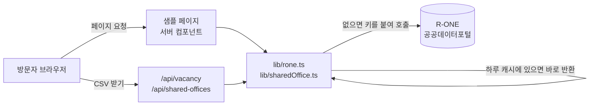

# 스터디 노션 (React 버전)

노션 학습 가이드 사이트를 Next.js로 다시 만든 버전입니다.
같은 내용을 정적 HTML로 만든 버전이 `../study-notion-landing` 에 있고,
이 저장소는 **같은 결과물을 컴포넌트와 데이터로 나누면 무엇이 달라지는지** 보기 위한 것입니다.

여기에 **샘플 갤러리**(`/samples`)를 더해, 공공 API 데이터로 만든 라이브 데모와
같은 결과물을 노션으로 따라 만드는 방법을 함께 보여줍니다.

| 샘플 | 주소 | 쓰는 외부 API |
|---|---|---|
| 서울 오피스 공실률 대시보드 | `/samples/office-market` | 한국부동산원 R-ONE Open API |
| 전국 공유 오피스 지도 | `/samples/shared-office` | 공공데이터포털 · 한국문화정보원 전국 공유 오피스 시설 데이터 |
| 노션 DB를 진짜 DB로 옮기면 | `/samples/notion-vs-db` | Supabase (예시 데이터를 넣어 둔 데이터베이스) |

## 실행

API 키 두 개가 필요합니다. 프로젝트 폴더에 `.env.local` 파일을 만들고 아래처럼 적습니다.
이 파일은 `.gitignore` 의 `.env*` 규칙으로 GitHub에 올라가지 않습니다.

```
REB_API_KEY=한국부동산원 R-ONE 인증키
DATA_GO_KR_KEY=공공데이터포털 일반 인증키(Decoding)

# Supabase (없어도 실행됩니다. 3번째 샘플은 "연결 전" 안내, API 백업은 꺼짐)
SUPABASE_URL=Supabase 프로젝트 주소
SUPABASE_PUBLISHABLE_KEY=Supabase publishable 키
SUPABASE_SECRET_KEY=Supabase secret 키
```

```bash
npm install
npm run dev     # 개발 서버 (localhost:3000)
npm run build   # 배포용 결과물 생성
npm start       # 생성된 결과물로 서버 실행
```

## 폴더 구조

```
app/
  layout.tsx          모든 페이지의 공통 뼈대 (네비·푸터가 여기 한 번만)
  page.tsx            랜딩
  level/[n]/page.tsx  레벨 다섯 페이지가 이 파일 하나
  samples/            샘플 갤러리 목록과 샘플 상세 페이지 2개
  api/vacancy/        백엔드 · 공실률 API (JSON / CSV)
  api/shared-offices/ 백엔드 · 공유 오피스 API (JSON / CSV)
  api/reactions/      백엔드 · "도움이 됐어요" 개수 읽기 / 더하기
  globals.css         디자인 토큰 + 스타일 전부
lib/
  rone.ts             R-ONE 호출 · 하루 캐시 (서버 전용)
  sharedOffice.ts     공공데이터포털 호출 · 하루 캐시 (서버 전용)
  sharedOfficeModel.ts 공유 오피스 데이터 모양 · 거르기 · 같은 주소 묶기
components/
  Section.tsx         섹션 껍데기 (여백이 기본값)
  Shot.tsx            화면 재현 + 해설 묶음 (해설이 필수 항목)
  StepBody.tsx        실습 한 단계를 그림
  LevelHero.tsx       레벨 머리 카드
  RelationAnalogy.tsx 관계형·롤업 비유 그림
  DbViewer.tsx        데이터베이스 체험 위젯
  FaqList.tsx         자주 묻는 질문 (부드럽게 펼침)
  VacancyCards.tsx    공실률 카드
  SharedOfficeExplorer.tsx 공유 오피스 지역 선택 · 거르기 · 목록
  OfficeMap.tsx       공유 오피스 지도 (Leaflet)
  CopyButton.tsx      노션 AI 질문 복사 버튼
  ReactionButton.tsx  "도움이 됐어요" 버튼
  screens/            노션 화면 재현 8종 + 샘플용 (office/)
data/
  levels.ts           레벨 다섯 개의 내용 전부
  landing.ts          랜딩의 반복 항목 (문제 카드·학습 방식·대상자·FAQ)
  tasks.ts            체험 위젯이 쓰는 업무 목록
  samples.ts          샘플 갤러리 목록 (한 덩어리 추가 = 샘플 하나 추가)
lib/supabase.ts       Supabase 연결 (서버 전용, 키를 읽는 유일한 곳)
lib/snapshot.ts       공공 API 백업 저장·불러오기
lib/notionDb.ts       3번째 샘플의 데이터 조회
lib/reactions.ts      "도움이 됐어요" 저장·개수 세기
supabase/schema.sql   Supabase 표·권한·예시 데이터 (SQL Editor 에서 한 번 실행)
```

## Supabase

세 곳에 씁니다. 로그인이나 방문자 정보 수집은 없습니다.

| 쓰는 곳 | 하는 일 | 쓰는 키 |
|---|---|---|
| 샘플 `/samples/notion-vs-db` | 레벨 5 예시(프로젝트·업무)를 실제 DB 표로 보여줌. 읽기만 가능 | publishable |
| 공공 API 백업 | 공실률·공유 오피스를 받아올 때마다(하루 한 번) 저장해 두고, 원본 API가 멈추면 저장본과 "저장한 날짜" 안내를 대신 보여줌 | secret |
| "도움이 됐어요" 버튼 | 레벨·샘플 페이지 하단. 누를 때마다 `reactions` 표에 한 줄 추가, 줄 수를 세어 모든 방문자에게 같은 숫자를 보여줌. 누가 눌렀는지는 저장하지 않음 | secret |

세 키 모두 서버에서만 읽고 브라우저로 보내지 않습니다(`NEXT_PUBLIC_` 을 붙이지 않은 이유).

### 처음 한 번 설정 (10분 안팎)

1. [supabase.com](https://supabase.com) 에서 프로젝트를 만듭니다.
2. SQL Editor 에 `supabase/schema.sql` 전체를 붙여넣고 실행합니다.
3. Project Settings → API Keys 의 주소·publishable 키·secret 키를 `.env.local` 에 적고 개발 서버를 다시 켭니다.
4. `/samples/notion-vs-db` 에 표가 나오면 샘플 연결 완료. 공실률·공유 오피스 페이지를 한 번 열면 `api_snapshots` 표에 백업이 두 줄 생깁니다.
   레벨 페이지 하단의 "도움이 됐어요"를 누르면 `reactions` 표에 한 줄이 생기고 숫자가 오릅니다.
   백업은 하루 캐시가 비었을 때만 저장되므로, 줄이 안 생기면 개발 서버를 끄고 `.next/cache` 폴더를 지운 뒤 다시 열어 봅니다.

## 외부 API 적용

### 왜 백엔드(API Route)에서 부르는가

- **키 보호** - 브라우저에서 API를 부르면 키가 주소에 그대로 드러납니다.
  키를 읽는 곳은 `lib/rone.ts` 와 `lib/sharedOffice.ts` 두 파일뿐이고, 둘 다 서버에서만 실행됩니다.
- **CORS** - R-ONE은 다른 사이트의 브라우저가 직접 부르는 것을 막아 두었습니다(CORS 미지원).
  서버끼리 부르는 것은 막히지 않으므로 Next.js 서버가 대신 받아 옵니다.
- **캐시** - 두 자료 모두 자주 바뀌지 않아(분기 통계, 2022년 작성 자료) 하루 한 번만 새로 받습니다.
  방문자가 많아도 외부 API 호출 수는 늘지 않습니다.

### 데이터 흐름



페이지는 서버에서 데이터를 받아 HTML에 넣어 보내므로, 브라우저에는 키도 외부 API 주소도 전달되지 않습니다.

### 사용한 API

| | R-ONE Open API | 공공데이터포털 파일데이터 API |
|---|---|---|
| 제공 | 한국부동산원 | 한국문화정보원 |
| 호출 | `SttsApiTblData.do` | `api.odcloud.kr/api/15111411/v1/uddi:d93c5174-…` |
| 통계표·데이터 | `TT244763134428698` 임대동향 지역별 공실률(2024년3분기~)_오피스 | 전국 공유 오피스 시설 데이터 905건 |
| 주요 요청값 | `DTACYCLE_CD=QY`(분기), `CLS_ID`(권역), `ITM_ID=100001`(공실률) | `page`, `perPage=1000` |
| 가공 | 서울 · 도심 · 강남 · 여의도마포 4개 권역의 최근 분기 값과 직전 분기 대비 증감 | 같은 주소의 상품을 한 곳으로 묶음(905건 → 345곳), 편의시설 Y/N → 목록 |

### 백엔드 주소

| 주소 | 돌려주는 것 |
|---|---|
| `/api/vacancy` | 권역별 공실률 JSON |
| `/api/vacancy?format=csv` | 노션용 CSV (한 줄 = 권역 하나의 분기 하나) |
| `/api/shared-offices?sido=서울특별시&sigungu=강남구` | 지역별 공유 오피스 JSON |
| `…&amenity=주차&amenity=샤워실` | 편의시설이 모두 있는 곳만 |
| `…&format=csv` | 노션용 CSV (편의시설은 쉼표로 이어 다중 선택으로 가져가기 좋게) |

### 실패했을 때

- 외부 API가 오류를 내면 페이지는 "데이터를 불러오지 못했습니다"를 보여주고,
  백엔드 주소는 `{ error, detail }` JSON을 상태 코드 502로 돌려줍니다. `detail` 의 키는 `***` 로 가려집니다.
- R-ONE은 키가 틀려도 상태 코드 200으로 답하고 본문에 오류를 적기 때문에 본문을 직접 검사합니다.
- 실패한 응답은 캐시에 남기지 않습니다. 이미 성공한 적이 있으면 새로 받다 실패해도
  마지막으로 성공한 데이터를 계속 보여줍니다(Next.js 캐시 기본 동작).

## 정적 버전과 달라진 점

| | 정적 버전 | 이 버전 |
|---|---|---|
| 레벨 페이지 | HTML 5개 · 2,330줄 | 라우트 1개 + 데이터 |
| 네비·푸터 | 6개 파일에 복제 | 컴포넌트 1개 |
| 화면 재현 | 각 HTML에 흩어짐 | 컴포넌트 8종을 이름으로 호출 |
| 체험 위젯 | HTML 문자열을 만들어 밀어 넣음 | 고른 보기를 상태로 기억 |
| 섹션 여백 | `sec` 클래스를 매번 붙여야 함 | 여백이 기본값 |

## 구조에서 규칙을 강제한 부분

정적 버전에서 사람이 기억해야 했던 규칙 두 가지를 구조로 옮겼습니다.

- **해설은 화면 박스 밖에 둔다** - `Shot` 컴포넌트의 `caption` 이 필수 항목이라,
  화면만 넣고 해설을 빠뜨리면 빌드가 막힙니다.
- **여백 없는 섹션이 연달아 오면 간격이 0이 된다** - `Section` 은 여백이 기본값이라
  일부러 `pad={false}` 를 적지 않는 한 그 상황이 생기지 않습니다.

## 서버 컴포넌트와 클라이언트 컴포넌트

`'use client'` 가 붙은 파일은 버튼·지도처럼 브라우저에서 움직여야 하는 부품뿐입니다
(`DbViewer`, `FaqList`, `CopyButton`, `ReactionButton`, `SharedOfficeExplorer`, `OfficeMap`).
나머지는 서버에서 HTML로 만들어져 전달됩니다.

`npm run build` 를 하면 랜딩·레벨 5개·샘플 목록은 정적 HTML로 미리 만들어지고,
샘플 상세 2개와 백엔드 주소는 요청이 올 때 서버에서 만들어집니다(데이터는 하루 캐시).
어느 쪽이든 페이지마다 제목과 설명이 HTML 안에 그대로 들어가 공유 미리보기와 검색 노출이 유지됩니다.

## 스타일

`app/globals.css` 하나에 모여 있습니다. 정적 버전의 `style.css` 를 그대로 가져왔고,
맨 위 `@theme` 블록에서 색 토큰을 정의합니다. 정적 버전이 HTML 안 `tailwind.config` 에
적던 색과 같은 이름이라 `bg-canvas`, `text-ink` 처럼 그대로 쓸 수 있습니다.

## 외부 리소스

- Pretendard Variable (CDN) - 한글 웹폰트
- Leaflet + OpenStreetMap - 공유 오피스 지도. 키가 필요 없고, 지도 오른쪽 아래에 출처를 표기합니다
- 노션 화면은 이미지가 아니라 CSS로 그린 재현입니다. 외부 이미지에 의존하지 않습니다.
